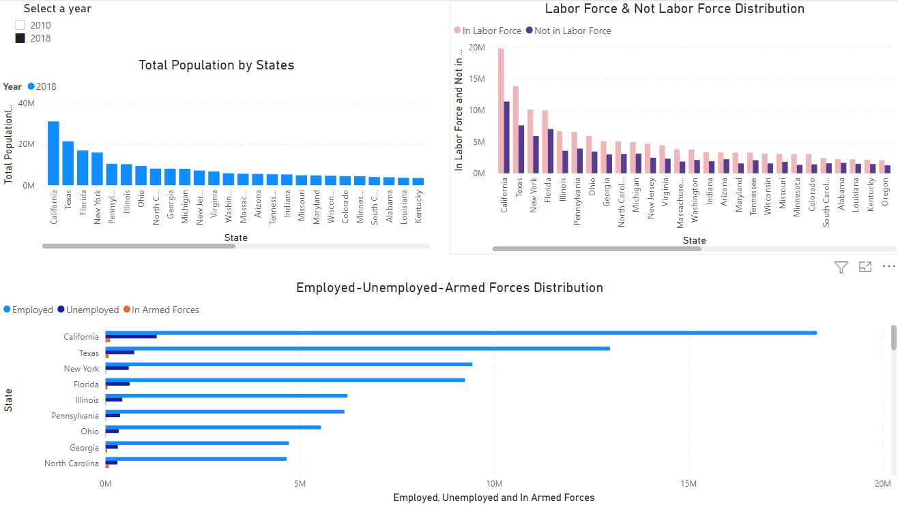
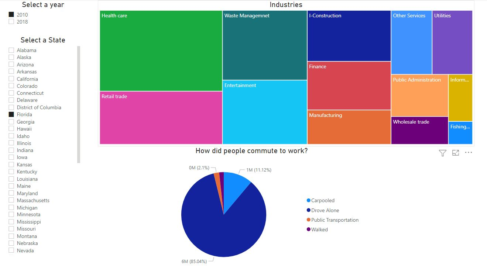
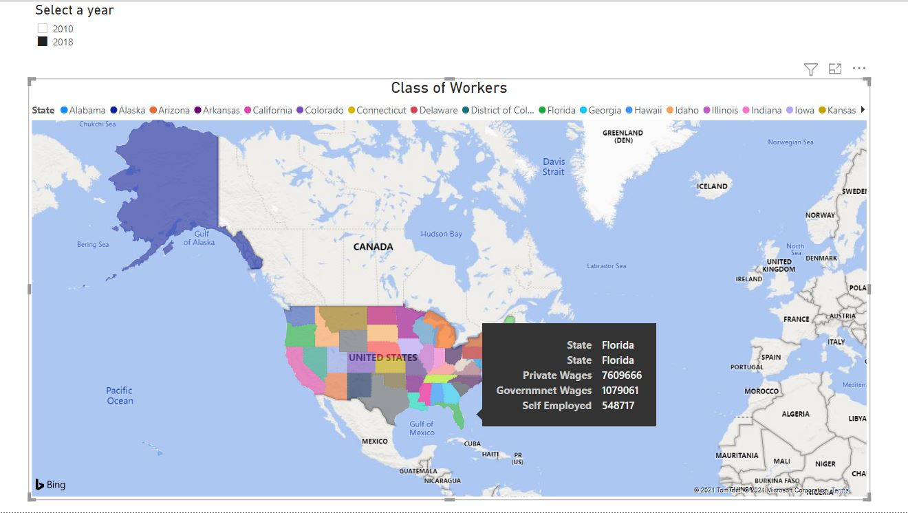
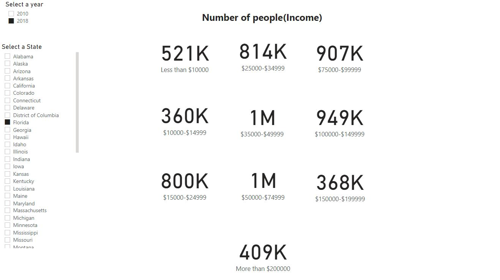

# Statistical-Graphical Analysis of Economic Data
## Overview: 
Collected dataset from United States government census official website (https://www.census.gov/). It has economic charateristics like Employement status, Occupation of people, way of commuting, income range of people, information about the industries, etc. The data is from 2010 and 2018. 

## Analysis aim
- Economic development of individual states
- Which industries are blooming?
- How did people commute to work?
- How much they are earning? Income range.
- Comaprison between Government Vs Private sectors

This analysis revealed that private sector employment dominated across all states, with notable growth in transportation and warehousing industries between 2010 and 2018.

## Statistical and Graphical Representation
### Report 1:
- Comparision between the distribution labor and non-labor workforce based on the population.
- how many people are in the Military and their employment distribution.

### Report 2
- How many people are working in what kind of industry.
- The way of their commute to work like carpooled, public trasportation, drove alone or walked.

### Report 3
People are either from government sector or private sector. It has information included if people are self-employed.

### Report 4
This report shows the range of the earning of people. 

